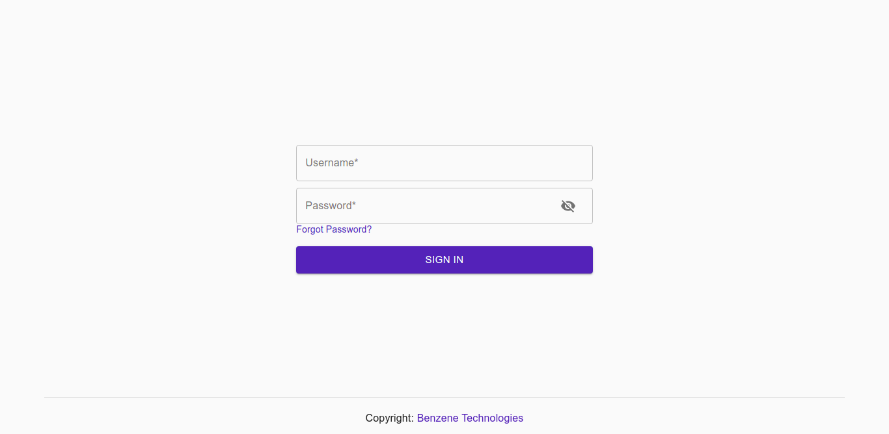
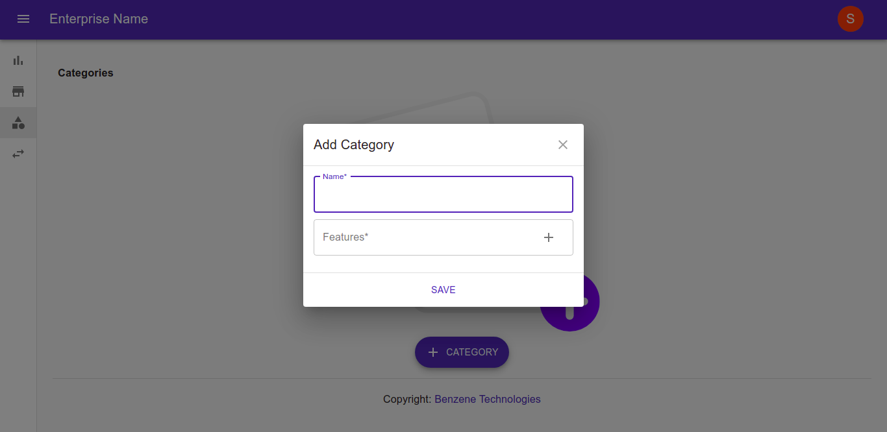
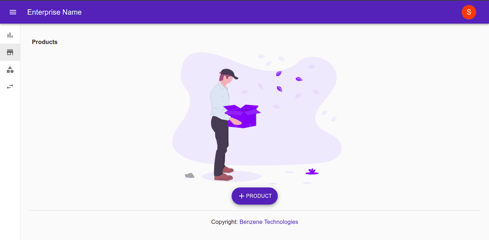
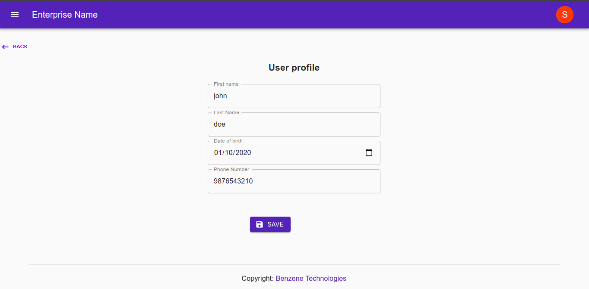
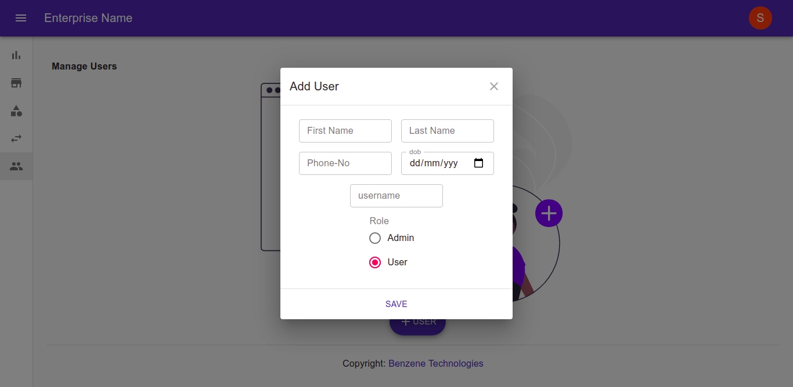

# Inventory Management

Inventory Management is a headless inventory management platform built on Node.js, React.js and Kubernetes.

# Demo

Here are some screenshots of the application.


<figcaption>Login page</figcaption>


<figcaption>Adding category</figcaption>


<figcaption>Product page</figcaption>


<figcaption>Profile page</figcaption>


<figcaption>Adding new user</figcaption>

# Getting Started

Follow the steps below to initialize the development platform on your local system.

## Software Dependencies

- [Node.js](https://nodejs.org/)
- [Yarn](https://yarnpkg.com/)
- [Docker](https://docker.com/)
- [Kubernetes](https://kubernetes.io/)
- [Ingress NGINX](https://kubernetes.github.io/ingress-nginx/)
- [Skaffold](https://skaffold.dev)

## Setting up the Development Platform for Windows:

Clone the repository in your local machine.

```sh
git clone https://github.com/benzene-tech/inventory-management.git
```

Run the setup file to install all the micro-services.

```sh
cd inventory-management && bash setup
```

This command will check for any missing software dependencies and will pull the latest Docker Images of the micro-services.

Once the script is executed without any errors, add the DNS inventory-management.com to your hosts file. This will require a super-user.

```sh
sudo vim /etc/hosts
```

Append the below snippet to the file.

```
127.0.0.1 inventory-management.com
```

Add JWT-Secret using

```sh
kubectl create secret generic jwt-secret --from-literal=JWT_SECRET=dptUHjXVkKB2TdPy4ZmbPdC2GqTDHQW5
```

Create Ingress Resource using

```sh
kubectl apply -f https://raw.githubusercontent.com/kubernetes/ingress-nginx/controller-v0.46.0/deploy/static/provider/cloud/deploy.yaml
```

Run the development cluster with

```sh
skaffold dev
```

## Setting up the Development Platform for Linux:

Docker Installation and Setting Docker Group:
```sh
sudo apt-get remove docker docker-engine docker.io containerd runc
```

```sh
sudo apt-get update
```

```sh
sudo apt-get install \
    apt-transport-https \
    ca-certificates \
    curl \
    gnupg \
    lsb-release
```

```sh
curl -fsSL https://download.docker.com/linux/ubuntu/gpg | sudo gpg --dearmor -o /usr/share/keyrings/docker-archive-keyring.gpg
```

```sh
echo \
  "deb [arch=amd64 signed-by=/usr/share/keyrings/docker-archive-keyring.gpg] https://download.docker.com/linux/ubuntu \
  $(lsb_release -cs) stable" | sudo tee /etc/apt/sources.list.d/docker.list > /dev/null
```

```sh
sudo apt-get update
```

```sh
sudo apt-get install docker-ce docker-ce-cli containerd.io
```

```sh
sudo groupadd docker
```

```sh
sudo usermod -aG docker $USER
```

Kubernetes Setup:

Install Minikube:
```sh
wget https://storage.googleapis.com/minikube/releases/latest/minikube-linux-amd64
```

```sh
cp minikube-linux-amd64 /usr/local/bin/minikube
```

```sh
chmod 755 /usr/local/bin/minikube
```

Install Kubectl and Kudedm
```sh
curl -s https://packages.cloud.google.com/apt/doc/apt-key.gpg | sudo apt-key add -
```

```sh
echo "deb http://apt.kubernetes.io/ kubernetes-xenial main" | tee /etc/apt/sources.list.d/kubernetes.list
```

```sh
sudo apt-get update -y
```

```sh
sudo apt-get install kubectl kubeadm kubectl -y
```
Start Minikube
```sh
minikube start
```

Enable Ingress Addon

```sh
minikube addons enable ingress
```

Clone the repository in your local machine.

```sh
git clone https://github.com/benzene-tech/inventory-management.git
```

Run the setup file to install all the micro-services.

```sh
cd inventory-management && bash setup
```

This command will check for any missing software dependencies and will pull the latest Docker Images of the micro-services.

Once the script is executed without any errors, Navigate to the local inventory-management folder.

Create Ingress Resource
```sh
kubectl apply -f ./kubernetes/ingress-svc.yaml
```

Obtain Minikibe IP:
```sh
minikube ip
```

Add the DNS inventory-management.com to your host file.
```sh
sudo nano /etc/hosts
```

Paste the obtained IP as
```
$IPv4Address inventory-management.com
```

Add JWT-Secret using
```sh
kubectl create secret generic jwt-secret --from-literal=JWT_SECRET=dptUHjXVkKB2TdPy4ZmbPdC2GqTDHQW5
```

Run the development cluster with
```sh
skaffold dev
```

